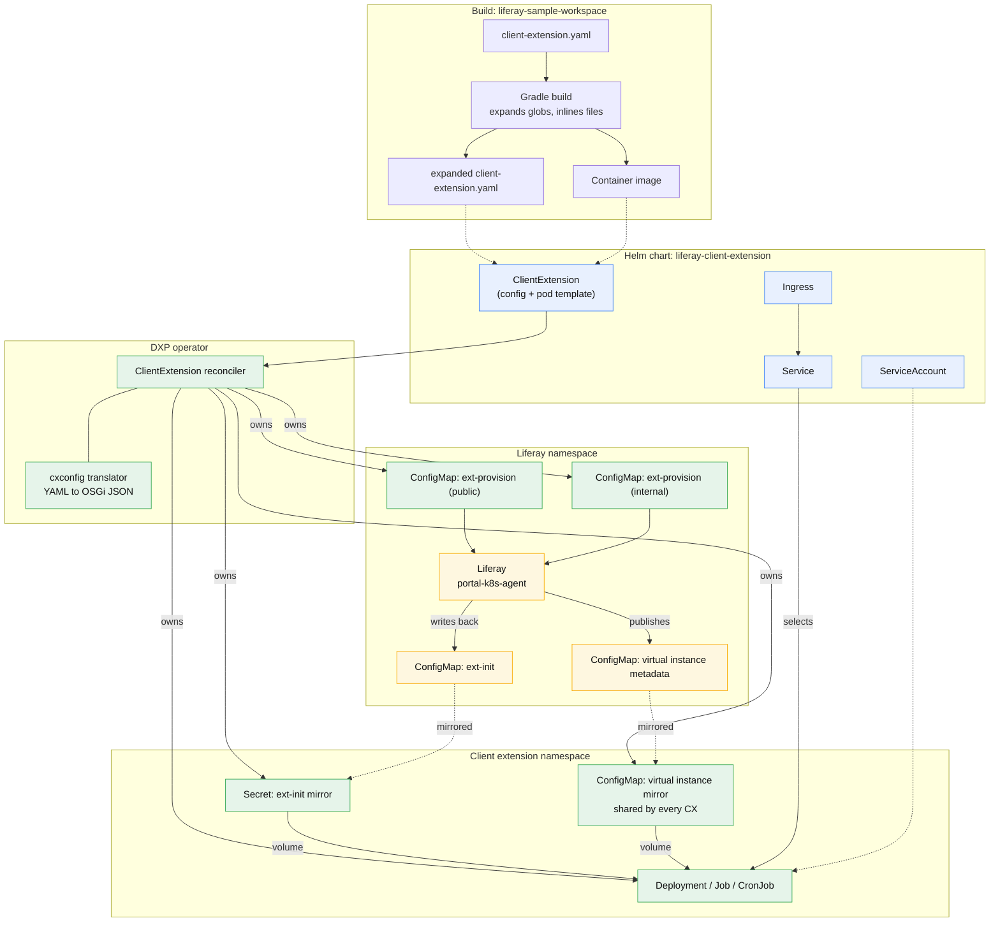
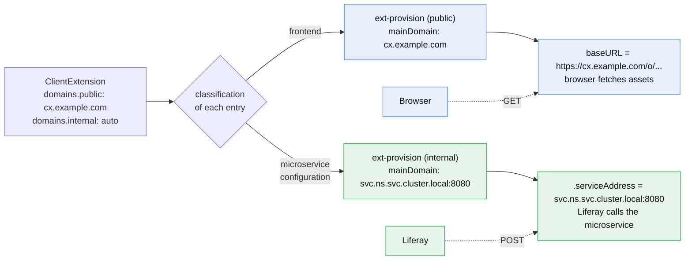
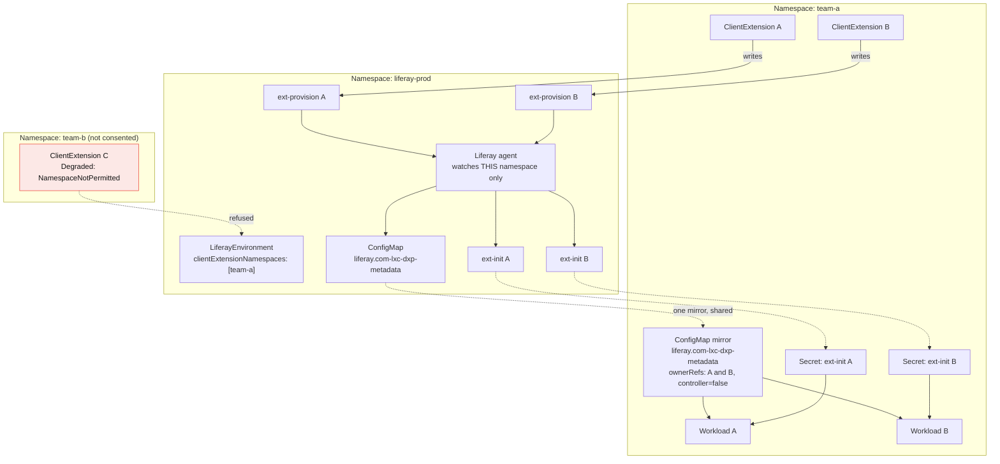

# Client Extensions On Kubernetes: Diagrams

Companion to `CLIENT_EXTENSION_DESIGN.md`. Every arrow here is exercised by the scripts in `hack/`.

## Who Owns What

The chart owns the objects a platform team expects to configure. The operator owns the objects whose lifetime depends on Liferay having answered.



Blue is chart-owned, green is operator-owned, amber is written by Liferay.

## The Handshake

The ordering problem the chart cannot solve: the workload mounts credentials that do not exist until Liferay has read the configuration and answered.

```mermaid
sequenceDiagram
    autonumber
    participant H as Helm
    participant K as API server
    participant O as DXP operator
    participant L as Liferay agent
    participant W as Workload pod

    H->>K: apply ClientExtension (+ Service, Ingress, ServiceAccount)
    K-->>O: watch event

    O->>K: get LiferayEnvironment
    Note over O: consent check:<br/>is this namespace listed?
    O->>K: get <vi>-lxc-dxp-metadata
    Note over O: does Liferay know<br/>this virtual instance?

    O->>O: translate client-extension.yaml<br/>split by classification
    O->>K: apply ext-provision (public) + ext-provision (internal)
    Note over O: update in place, never recreate:<br/>Liferay keys configurations by ConfigMap UID
    O->>K: status Delivered=True

    K-->>L: watch event on metadataType=ext-provision
    L->>L: labels become configuration properties;<br/>mainDomain sets baseURL and .serviceAddress
    L->>L: create client extension types<br/>and OAuth2 applications
    L->>K: write ext-init ConfigMap<br/>(client id + plaintext client secret)

    K-->>O: watch event on metadataType=ext-init
    O->>K: list by serviceId label
    Note over O: found by label, never by<br/>reconstructing the name
    O->>K: mirror into a Secret in the CX namespace
    O->>K: mirror virtual instance metadata if namespaces differ
    O->>K: status Provisioned=True

    O->>K: apply Deployment / Job / CronJob
    Note over O: only now: the pod would<br/>hang on a missing mount otherwise
    K-->>W: schedule pod
    W->>W: mount /etc/liferay/lxc/dxp-metadata<br/>and /etc/liferay/lxc/ext-init-metadata
    W->>L: authenticate with the provisioned credentials
    O->>K: status Ready=True
```

## Dual Domains

A frontend asset is fetched by a browser and needs a routable host. A microservice is called by Liferay and can use a cluster-internal address. Liferay resolves both from one `mainDomain` annotation per ConfigMap, so the operator splits the payload.



## Cross Namespace

Liferay's agent is bound to exactly one namespace on both read and write, so the operator is the only thing that can bridge the gap.



Note that the ext-provision ConfigMaps carry **no owner reference**: owner references must be same-namespace, and a cross-namespace one causes the garbage collector to delete the dependent. A finalizer cleans them up instead.