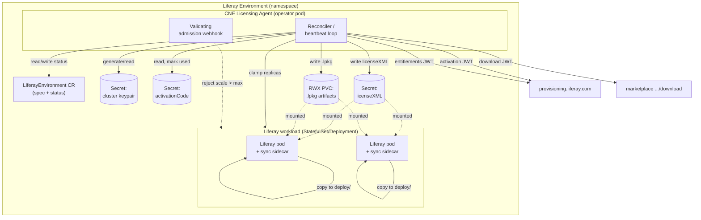

# CNE Licensing Agent — Technical Design

## Purpose

The CNE Licensing Agent is a Kubernetes controller that manages the full
lifecycle of a Liferay DXP license for a *Liferay environment* — one logical
Liferay cluster running in a single Kubernetes namespace. It registers the
environment with Liferay's provisioning API, distributes the returned license
XML to every Liferay pod, enforces the licensed cluster-node ceiling on the
workload's replica count, downloads and deploys entitled Marketplace add-ons,
and re-validates all of the above on a heartbeat so that asynchronous changes
(expiry, renewal, upgrade, node-count change, new entitlements) converge without
operator intervention.

## Glossary

- **Environment** — a logical Liferay cluster confined to one Kubernetes
  namespace. Identified to provisioning by `environmentId`.
- **`environmentId`** — the Kubernetes namespace `metadata.uid`. Stable for the
  life of the namespace, globally unique, and used by provisioning for its DDOS
  allowlist.
- **Cluster keypair** — an RSA/EC keypair unique to the environment. The private
  key signs every JWT to provisioning; the public key is registered with
  provisioning during activation.
- **`activationCode`** — a one-time-use UUID issued out of band (one for prod,
  one for non-prod). Consumed by the activation call.
- **Logical node** — one Liferay JVM (one pod) participating in the cluster. The
  license caps this at `maxClusterNodes`.

## Requirements Recap

1. Register (activate) the environment with the provisioning API.
2. Persist the license XML and deploy it to every Liferay pod.
3. Re-check license validity on an interval; react to async status changes.
4. Enforce `maxClusterNodes` against the workload replica count, and reject
   operator attempts to scale beyond it.
5. Discover entitled Marketplace add-ons, download their `.lpkg` binaries, and
   deploy them to the pods.

## Provisioning API Contract (as given)

| # | Method + Path | JWT Payload | Response |
|---|---|---|---|
| 1 | `POST /o/provisioning-rest/v1.0/cloud/environment/{environmentId}/activation` | `{activationCode, publicKey, environmentId, environmentName}` | `200` (no content) or `404` |
| 2 | `POST /o/provisioning-rest/v1.0/cloud/environment/{environmentId}/entitlements` | `{environmentId, dxpVersion}` | `{licenseXML, maxClusterNodes, apps: [{name, lpkgDownloadLink}]}` |
| 3 | `POST /marketplace/virtual-entry/{virtualEntryId}/download` | `{environmentId, virtualEntryId}` | `app.lpkg` binary |

All request bodies are a JWT signed with the environment's **private** key.

## Trust Model

The trust bootstrap is **trust-on-first-use**, anchored by the one-time
`activationCode`:

- The **activation** JWT (call #1) is self-signed: it *carries* the public key
  in its payload, because provisioning does not yet hold it. Provisioning
  authenticates this request by the secret, one-time `activationCode` bound to
  the caller-asserted `environmentId`, and on success stores
  `(environmentId → publicKey)`.
- Every **subsequent** call (#2, #3) is verified against that stored public key.
  The agent never sends the public key again, and the `activationCode` is spent.

The `activationCode` is delivered **out of band and confidentially**: a DevOps
operator logs into the Liferay license portal, obtains the environment's
`activationCode`, and transfers it into the Kubernetes cluster installation
(landing in the `activationCodeSecretRef` Secret). Securing that transfer is a
DevOps responsibility outside the agent's boundary; the agent's contract begins
once the code is present in the Secret. Because the whole trust bootstrap rests
on this code, it must be treated as a credential — confidential in transit and
one-time in use.

Consequences for the design:

- The private key must **never leave the agent**. Pods receive rendered
  artifacts (license XML, `.lpkg`), never the key. This rules out any design
  where each pod calls provisioning directly.
- Activation happens exactly once per environment and must be idempotent from
  the agent's side (a replayed `activationCode` returns `404`; the agent must
  treat "already activated" as success, tracked in its own status).
- JWTs are short-lived (`exp` ≈ 60s) with `iss = environmentId`, `iat`, and a
  `jti` for replay resistance. Signature algorithm `RS256` (or `ES256`).

## High-Level Architecture



### Component Inventory

- **`LiferayEnvironment` CRD** (namespace-scoped) — the desired state and the
  single source of observed status.
- **Reconciler** — a Go / Kubebuilder (controller-runtime) reconcile loop.
  Handles activation, the entitlements heartbeat, license/app reconciliation, and
  replica clamping.
- **Validating admission webhook** — rejects `Scale` subresource updates and
  spec edits that push replicas above the current `maxClusterNodes`.
- **Cluster-keypair Secret** — agent-generated, agent-only RBAC.
- **`activationCode` Secret** — supplied at provisioning time; consumed once.
- **License Secret** — holds the current `licenseXML` (small, fits the 1 MiB
  Secret limit).
- **Artifact PVC (RWX)** — holds `.lpkg` binaries (too large for Secrets).
- **License-sync sidecar** — one per Liferay pod; copies mounted artifacts into
  that pod's `deploy/` directory and re-copies when they change.

## The `LiferayEnvironment` Custom Resource

One CR per environment (namespace). Example:

```yaml
apiVersion: licensing.liferay.com/v1alpha1
kind: LiferayEnvironment
metadata:
  name: default
  namespace: acme-prod
spec:
  environmentName: "ACME Production"          # optional, human-readable
  activationCodeSecretRef:
    name: cne-activation-code
    key: activationCode
  workloadRef:                                # what the agent scales/enforces
    kind: StatefulSet
    name: liferay-dxp
  desiredReplicas: 3                           # operator intent; clamped to max
  dxpVersion: ""                               # optional override; else derived
  heartbeatInterval: 10m
status:
  phase: Ready                                 # Pending|Activating|Ready|Degraded|Suspended
  environmentId: "9f1c...-namespace-uid"
  activatedAt: "2026-07-20T15:04:05Z"
  license:
    validUntil: "2026-12-31T23:59:59Z"
    maxClusterNodes: 3
    checksum: "sha256:..."                     # of current licenseXML
    lastVerified: "2026-07-20T15:14:05Z"
  effectiveReplicas: 3                          # min(desiredReplicas, maxClusterNodes)
  apps:
    - name: "Acme Connector"
      virtualEntryId: "12345"
      checksum: "sha256:..."
      state: Deployed
  conditions:
    - type: Activated       status: "True"
    - type: LicenseValid    status: "True"
    - type: ReplicasClamped status: "False"    # True when desired > max
    - type: ProvisioningReachable status: "True"
```

Design notes:

- `dxpVersion` is derived from the Liferay container image tag on `workloadRef`
  when `spec.dxpVersion` is empty; the spec field is an escape hatch.
- `desiredReplicas` captures operator intent separately from the enforced value
  so the UI can show "you asked for 5, license allows 3."
- `status.conditions` follows the standard Kubernetes condition convention and
  drives observability/alerting.

## Reconciliation Flow

The reconciler is level-triggered and idempotent. One pass:

```mermaid
sequenceDiagram
    participant R as Reconciler
    participant K as K8s API
    participant P as Provisioning
    participant M as Marketplace

    R->>K: ensure cluster keypair Secret (generate if absent)
    alt not yet activated
        R->>P: POST activation (JWT{activationCode, publicKey, envId, envName})
        alt 200
            R->>K: status.Activated=True; mark activationCode used
        else 404
            R->>K: condition ActivationFailed; stop (needs new code)
        end
    end
    R->>P: POST entitlements (JWT{envId, dxpVersion})
    alt 200
        R->>K: write licenseXML to Secret if checksum changed
        R->>R: reconcile replicas = min(desired, maxClusterNodes)
        R->>K: patch workload replicas; set ReplicasClamped
        loop each app not already Deployed
            R->>M: POST download (JWT{envId, virtualEntryId})
            M-->>R: app.lpkg
            R->>K: write .lpkg to artifact PVC; status app=Deployed
        end
        R->>K: update license status + conditions
    else network / 5xx
        R->>K: condition ProvisioningReachable=False (keep last-known-good)
    end
    R->>K: requeue after spec.heartbeatInterval
```

The heartbeat is the requeue interval; no separate `CronJob` is needed. Each
pass is a full reconcile, so a change on the provisioning side (renewal,
node-count change, new app, revocation) converges on the next tick.

## License Distribution To Pods

The license XML must land in each pod's Liferay `deploy/` directory so Liferay's
auto-deploy transforms it into the binary `.LI` file under `data/`. Two facts
shape the design:

1. A mounted volume is read-only and updated in place, but Liferay *consumes*
   (moves/deletes) files dropped in `deploy/`. So we cannot mount the Secret
   directly at `deploy/`.
2. The license changes over time (heartbeat), and we want to re-trigger Liferay
   without restarting pods where possible.

**Chosen approach — sync sidecar.** Each Liferay pod gets a lightweight sidecar:

- The license Secret is mounted read-only at `/mnt/license/`.
- The sidecar watches the mounted path (kubelet refreshes projected Secrets in
  place within ~1 min) and, on checksum change, copies the XML into the shared
  `deploy/` volume (an `emptyDir` or the Liferay home volume shared with the main
  container). Liferay picks it up and re-transforms it — no restart.
- An **init container** performs the first copy before Liferay starts, so a cold
  pod is licensed on boot.

This keeps the private key central, survives license rotation without a rollout,
and works identically for `.lpkg` artifacts (below).

## Marketplace Add-On Distribution

`entitlements` returns `apps: [{name, lpkgDownloadLink}]`, where
`lpkgDownloadLink` is a **full marketplace URL** that embeds the
`virtualEntryId` — the ID of that downloadable Liferay `.lpkg` artifact — as its
`{virtualEntryId}` path segment. For each app the agent does not already have
(tracked by `status.apps[].checksum`):

1. Parse `virtualEntryId` out of the `lpkgDownloadLink` path (the segment after
   `/marketplace/virtual-entry/`).
2. `POST` to `lpkgDownloadLink` with JWT `{environmentId, virtualEntryId}`.
3. Receive the `.lpkg` binary.
4. Write it to the **artifact PVC** — *not* a Secret/ConfigMap, because `.lpkg`
   files routinely exceed the 1 MiB object limit.
5. The sync sidecar copies new/changed `.lpkg`s from the mounted PVC into each
   pod's `deploy/`, and Liferay installs them.

Idempotency: an app is downloaded once and re-verified by checksum each
heartbeat. Removed entitlements can optionally be uninstalled (drop the file and
signal Liferay); the first release treats removal as a no-op and only logs, to
avoid destructive surprises.

Storage: a **dedicated `ReadWriteMany` PVC** provisioned by the agent, since all
pods need concurrent read access and only the agent writes. Requires an RWX-capable
StorageClass in the CNE cluster (NFS, CephFS, EFS, Azure Files, etc.) — confirm
one is available.

## Replica / Node-Count Enforcement

Two complementary mechanisms, because they cover different threats:

1. **Reconcile-time clamp (correctness).** The reconciler always sets the
   workload's replicas to `min(spec.desiredReplicas, maxClusterNodes)` and
   reports `ReplicasClamped`. If a heartbeat *lowers* `maxClusterNodes` below the
   running count, the agent scales the workload **down** to the new max so the
   surplus JVM (which would fail license validation on start) is removed
   gracefully rather than crash-looping.
2. **Validating admission webhook (prevention).** A `ValidatingWebhookConfiguration`
   intercepts updates to the workload's `scale` subresource and its
   `spec.replicas`. If the requested count exceeds the current
   `maxClusterNodes` (read from the CR status or a mirrored ConfigMap), the
   webhook **rejects** the request with an explanatory message:
   `replicas 5 exceeds licensed maxClusterNodes 3`. This stops a human
   `kubectl scale` at the door, before the N+1 pod is ever scheduled.

The webhook needs a serving certificate; use cert-manager or the operator's own
self-signed CA rotated on a timer. The webhook must **fail-open on its own
outage** (a `failurePolicy: Ignore` with alerting) so a broken webhook can't
freeze all scaling of the workload — the reconcile clamp remains the backstop.

Workload kind: the Liferay cluster runs as a **StatefulSet** for stable per-node
identity. The agent references it via `workloadRef` and touches only the replica
count (and the StatefulSet `scale` subresource), so the same logic would apply to
a Deployment if that ever changes.

## Failure Handling & Grace

The agent delivers truth; it does not unilaterally disable Liferay. Principles:

- **Provisioning unreachable** → keep last-known-good license, set
  `ProvisioningReachable=False`, retry with capped exponential backoff. The
  license XML has its own embedded validity; the agent must not yank a valid
  license because the control plane blipped. Define a **grace window** (e.g. 72h)
  after which `Degraded` escalates to alerting, but pods keep running.
- **License revoked/expired** (provisioning returns an invalid/expired license)
  → write the new license and let Liferay's own validation drop to its limited
  mode. The agent's job is fidelity, not enforcement of runtime behavior.
- **Node-count reduction** → scale down to the new max (as above). This is the
  one case where the agent proactively changes the running topology, because the
  alternative is a guaranteed startup failure.
- **Activation 404** → terminal for that `activationCode`; surface
  `ActivationFailed` and require operator intervention (new code). Do not hammer
  the endpoint.
- **App download failure** → per-app backoff; a failed app does not block the
  license or other apps.

## Security

- Cluster private key in a Secret with RBAC restricted to the agent's
  ServiceAccount only; consider `encryption-at-rest`/KMS and, longer term, a
  non-exportable key backend (e.g. sealed/HSM/CSI secrets store).
- Egress `NetworkPolicy` limiting the agent to the provisioning and marketplace
  hosts on `443`.
- All calls over TLS with certificate verification pinned to Liferay hosts.
- `activationCode` Secret readable only by the agent; marked used in status once
  consumed so it is never re-sent.
- JWTs short-lived with `jti`; clock-skew tolerance small.
- The webhook and reconciler run with least-privilege RBAC (see below).

## RBAC (agent ServiceAccount)

- `LiferayEnvironment`: `get,list,watch,update,patch` (+ `status` subresource).
- `secrets`: `get,list,watch,create,update` scoped to the agent's namespace(s).
- `statefulsets`/`deployments` and their `scale` subresource: `get,list,watch,patch`.
- `persistentvolumeclaims`: `get,list,watch` (create if the agent provisions the
  artifact PVC).
- `events`: `create` for surfacing reconcile outcomes.
- `validatingwebhookconfigurations`: `get,update` only if the agent self-manages
  its webhook cert/CA bundle.

## Settled Decisions

- **Operator stack:** Go + Kubebuilder (controller-runtime).
- **Workload kind:** StatefulSet, referenced via `workloadRef`.
- **`.lpkg` storage:** a dedicated agent-provisioned `ReadWriteMany` PVC.
- **App download link:** `lpkgDownloadLink` is a full URL with `virtualEntryId`
  embedded in the path; the agent parses it and `POST`s to the link.
- **De-provisioning:** removed entitlements are log-only in the first release.
- **Environment model:** one environment = one namespace = one CR; the
  prod/non-prod `activationCode` is injected as the referenced Secret.

## Open Decisions (need your call)

1. **RWX StorageClass availability.** The artifact PVC needs an RWX-capable
   StorageClass (NFS/CephFS/EFS/Azure Files). Confirm one exists in the CNE
   clusters, or we fall back to an agent-served HTTP pull endpoint.
2. **Webhook cert management.** cert-manager (if present in CNE) vs an operator
   self-managed CA rotated on a timer. Recommendation: **cert-manager if
   available**.
3. **Provisioning sandbox for contract testing.** Is there a non-prod
   provisioning endpoint the agent can exercise end to end during Phase 1?

## Rollout Plan

1. CRD + reconciler skeleton with activation + entitlements heartbeat; license to
   a Secret; status/conditions. (No pod wiring yet — validate the API contract
   end to end against a provisioning sandbox.)
2. Sync sidecar + init container; license reaches `deploy/` and produces a `.LI`.
3. Replica clamp in the reconciler; then the validating admission webhook.
4. Marketplace app download to the artifact PVC + sidecar propagation.
5. Failure/grace hardening, NetworkPolicy, RBAC tightening, alerting on
   conditions.
```
